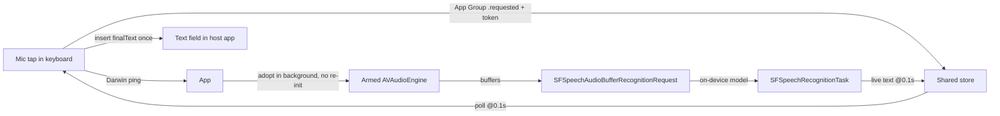

# Audio To Text (On-Device)

A dictation **keyboard extension + container app** for iOS. Tap the mic in any
text field, speak, and your words are transcribed **locally on the device** and
inserted into the field — no audio ever leaves the iPhone.

> Everything runs on the device. No audio is ever uploaded.

## Why this architecture exists (the hard-won learnings)

This project started as a plain SwiftUI dictation app, then grew a keyboard
extension. Three architecture attempts preceded the current one — each failed
for a different reason, and the current design exists **because of** those
failures:

1. **A keyboard extension CANNOT record audio.** Verified conclusively on
   iPhone 12 / iOS 26.6.1: `AVAudioEngine`, `AVAudioRecorder`, and
   `AVCaptureSession` all fail at the hardware I/O start
   (`PerformCommand(*ioNode, kAUStartIO…)` → code `2003329396` `'what'`), even
   with Full Access, a granted mic permission, and a perfect 1ch/48 kHz format.
   Three independent audio stacks failing at hardware start = process-level
   denial. Gboard/SwiftKey-style in-keyboard recording is impossible here.

2. **iOS cannot START the microphone while an app is backgrounded.** A
   backgrounded app that tries to initialize the input unit gets
   `NSOSStatusErrorDomain 560557684` (`'!int'`) from `AURemoteIO Initialize` —
   Apple's own log message: *"This problem only occurs if the app is
   backgrounded, else it works fine."* Recording may *continue* in the
   background once started, but it can never *start* there.

3. **A suspended app cannot be woken by Darwin notifications.**
   `CFNotificationCenter` Darwin pings are delivered only to *running*
   processes. The only way a keyboard can wake a dead/suspended container app
   is to cold-launch it via a URL scheme (`attotext://dictate`), which steals
   the foreground.

### The solution: an always-armed microphone

The container app keeps the mic **running continuously**:

- The capture engine starts while the app is **foreground** (scene `.active`,
  init, cold-launch).
- It then runs forever — including in the background (`UIBackgroundModes
  audio`), which also keeps the app process alive.
- A keyboard request (App Group `.requested` + Darwin ping) is adopted **in the
  background** by *starting the recognizer only* — the input unit is never
  re-initialized, so the `'!int'` failure is structurally impossible.
- Tradeoff: an orange microphone indicator stays in the status bar while the
  app is alive, and the mic is "hot" even when you're not dictating.

## How it works



### Handshake (keyboard ↔ app)

| State | Writer | Meaning |
|---|---|---|
| `.requested` | keyboard | new session with a UUID token |
| `.recording` | app | adopted; streaming `liveText` + `audioLevel` |
| `.transcribing` | app | stop requested; finalizing |
| `.ready` | app | `finalText` published → keyboard inserts once, clears |
| `.failed` | app | `errorMessage` published → keyboard shows it |

Keyboard → app controls: `stopFor` / `cancelFor` carry the SESSION TOKEN the
control is aimed at (a control for a dead session can never kill a new one),
plus a Darwin ping. `requestedAt` is the KEYBOARD's own request clock (the
app can't refresh it — both sides' request timeouts read it); `keyboardAliveAt`
is a keyboard presence marker (touched per poll) that lets the app finalize
an orphan session ~10 s after its keyboard vanished. Liveness is
`appHeartbeat` (written ONLY by the app — armed engine, session loop, ping):
the keyboard uses its **freshness** to decide Darwin-wake (4 s) vs
cold-launch (1.5 s), and detects app death fast (stale > 8 s → fail
immediately instead of hanging). `lastActivity` is protocol/speech activity
(idle timeouts); `readyAt` is the timestamp of `.ready` — the 10-minute
surprise-insert gate. A NEWER keyboard request always preempts whatever
session the app is serving, so a wedged app heals on the next mic tap.

### IPC keys

| Key | Writer | Meaning |
|---|---|---|
| `status` | both | state machine (`idle`/`requested`/`recording`/`transcribing`/`ready`/`failed`) |
| `sessionToken` | keyboard | UUID identifying the request |
| `liveText` / `audioLevel` | app | streaming partial transcript + mic level |
| `finalText` | app | final result (keyboard clears after inserting) |
| `errorMessage` | app | failure text (keyboard clears after showing) |
| `stopFor` / `cancelFor` | keyboard | session token the control targets + ping |
| `requestedAt` | keyboard | own request clock (keyboard-only writer; timeout base) |
| `keyboardAliveAt` | keyboard | presence marker (touched per poll; app orphan finalizer) |
| `lastActivity` | both | speech/protocol activity (idle timeouts, stale-request age) |
| `appHeartbeat` | **app only** | liveness; fresh = alive AND can serve in background |
| `readyAt` | app | when `.ready` was published (freshness gate for auto-insert) |
| `isColdStart` | app | unused legacy flag |

### Stability design (the app's lifecycle vs the keyboard)

The whole scheme depends on the app being alive **with the mic armed**.
That lifecycle has holes — iOS kills background apps, interruptions and
route changes and mediaserverd resets steal the input unit, and the app
cannot re-arm from the background (`'!int'` 560557684). The design closes
each hole:

1. **One engine, one recognizer, one process.** The app's own UI
   (TranscriptionView) drives sessions through the same
   `KeyboardDictationCoordinator` — a second `AVAudioEngine` sharing the
   session deactivates the armed one and silently breaks background
   dictation until a restart. `isAppSession` sessions never write the
   shared keyboard protocol.
2. **Engine-death recovery.** The arm-watcher (every 5 s) force-re-arms an
   engine that claims to run but delivered no buffers for 10 s (session
   stolen). Interruption-ended, route change and media-services-reset all
   force a clean teardown + re-arm (interruption-ended is the one case iOS
   permits a background re-arm).
3. **Honest heartbeat.** The app only claims liveness when it can actually
   serve (`isActive || engine running`). A dead/unarmed app goes silent, so
   the keyboard cold-launches it fast instead of waiting on a stale signal.
4. **Fast app-death detection.** While `.recording`/`.transcribing`, the
   keyboard fails within ~8 s of the heartbeat going stale (app force-quit)
   instead of hanging 55 s.
5. **Orphan-session adoption.** If the app is killed mid-session, the next
   cold-launch re-adopts shared `.recording`/`.transcribing` (restarting
   audio in the foreground) and surfaces a dangling `.ready` overlay.
6. **An empty dictation keeps the engine armed** — an empty result never
   costs a cold-launch on the next attempt.

### IPC stack

- **App Group** `group.com.example.AudioToTextOnMobile` — `UserDefaults` suite
  shared by both processes (with a local fallback suite if unprovisioned).
- **Darwin notifications** `com.example.AudioToTextOnMobile.dictation` —
  ping-only wakeups (`CFNotificationCenter`, no payload).
- **URL scheme** `attotext://dictate` — the only way to wake a dead app.
- **`UIBackgroundModes: [audio]`** — the armed capture engine keeps the app
  alive in the background.

## Project layout

```
AudioToTextOnMobile/
├── AudioToTextOnMobile/          Container app (owns capture + recognition)
│   ├── App/AudioToTextOnMobileApp.swift    scene phases, onOpenURL, overlay
│   ├── Services/KeyboardDictationCoordinator.swift
│   ├── Views/TranscriptionView.swift       standalone dictation UI
│   └── Views/Components/DictationSessionOverlay.swift
├── AudioToTextKeyboard/          Keyboard extension (UI + IPC only)
│   ├── KeyboardViewController.swift
│   ├── ViewModels/KeyboardState.swift      polling, timeouts, insert-once
│   └── Views/…                             mic button, recording overlay
├── Shared/                       Compiled into BOTH targets
│   ├── AppGroup.swift
│   ├── DarwinNotifications.swift
│   ├── DictationSharedState.swift          the state machine above
│   ├── AudioCaptureService.swift           always-armed AVAudioEngine
│   ├── SpeechRecognitionService.swift      on-device SFSpeechRecognizer
│   └── ObjCExceptionCatcher.*              NSException safety net
└── project.yml                   XcodeGen source of truth (entitlements here!)
```

## Build, install & test

Requires Xcode 26+ (iOS 26 SDK), [XcodeGen](https://github.com/yonaskolb/XcodeGen)
(2.46+), a signed Apple developer team, and a **physical iPhone** — third-party
keyboards cannot be tested in the simulator (the simulator host apps crash with
a UIKit/TextInput bug unrelated to this project).

```bash
# 1. Generate the Xcode project (entitlements are regenerated FROM project.yml)
xcodegen generate

# 2. Build for the device (UDID from: xcrun devicectl list devices)
xcodebuild -project AudioToTextOnMobile.xcodeproj -scheme AudioToTextOnMobile \
  -destination 'id=<UDID>' -derivedDataPath build build

# 3. Install + launch
xcrun devicectl device install app --device <UDID> build/Build/Products/Debug-iphoneos/AudioToTextOnMobile.app
xcrun devicectl device process launch --device <UDID> com.example.AudioToTextOnMobile

# 4. Verify the app group is embedded in BOTH signatures
codesign -d --entitlements :- build/Build/Products/Debug-iphoneos/AudioToTextOnMobile.app
codesign -d --entitlements :- build/Build/Products/Debug-iphoneos/AudioToTextOnMobile.app/PlugIns/AudioToTextKeyboard.appex
```

## Human-controlled agent workflow

From a clean checkout in a Herdr-managed terminal, run:

```bash
./scripts/herdr-team.sh "Describe the feature to build"
```

The runner creates isolated Architect, Implementer, Tester, and Master-review
worktrees. It never merges or pushes. It stops for human review only after the
Implementer has committed a clean change and both independent review gates have
approved it. Task reports and runtime logs stay local under `.ai/`.

### On-device setup

1. Settings → General → Keyboard → Keyboards → **Add New Keyboard** → *Audio To
   Text* → toggle **Full Access** ON.
2. **Open the app once** (grant Microphone + Speech if prompted) — this arms
   the mic. The orange mic indicator is expected.
3. Background the app (home button).
4. In Notes (or any field), tap the mic in the keyboard → stay in Notes,
   "Listening…" with live text → tap **stop** → text is inserted.

> After reinstalling the keyboard, **remove and re-add** it in Settings —
> LaunchServices caches `NSExtensionAttributes`.

### Known limitation

If the container app is **force-quit**, the next mic tap cold-launches it once
(a dead process cannot record and cannot be woken in the background). It stays
armed afterwards.

## Gotchas worth remembering

- **`xcodegen generate` TRUNCATES `.entitlements` files to empty `<dict/>` on
  every run** — silently. The build succeeds but the app installs *without*
  the App Group (no shared container → "app isn't installed"). Fix: declare the
  entitlement content in `project.yml` (`entitlements.properties`), and verify
  with `codesign -d --entitlements :-` after every rebuild.
- `CFNotificationCenterAddObserver` takes a `CFString` name but
  `CFNotificationCenterRemoveObserver` takes a `CFNotificationName` — not
  symmetric.
- Swift `do/catch` cannot catch Objective-C `NSException`s — AVFoundation calls
  must run inside an `ObjCExceptionCatcher` wrapper in the keyboard process.
- The on-device recognizer finalizes slowly; publish the live transcript
  promptly (~3s) rather than racing a long timeout, and never use short
  matching timeouts in two processes sharing a finish boundary.
- `UIInputViewController.requestOpenAccess` was removed in iOS 26.5 — Full
  Access is enabled purely in Settings.
- `PrimaryLanguage` must be declared in `NSExtension → NSExtensionAttributes`
  in the keyboard Info.plist or the host app crashes
  (`TIGetDefaultDictationLanguagesForKeyboardLanguage(nil)`).

## Privacy

- Mic + speech permission descriptions configured in `project.yml`.
- Recognition language is user-selectable: an **active** language plus up to
  four alternates (five total). They live in `Shared/DictationSettings.swift` (App
  Group defaults), the app's language sheet edits them, and the keyboard's
  globe key cycles between them. The recognizer is rebuilt for the active
  language (`SpeechRecognitionService.setLocale(_:)`).
- All recognition is on-device; the always-armed mic is the privacy cost of
  instant background dictation.

## Roadmap

- Mid-dictation language switching / speech-language auto-detection (the
  active language is currently fixed for the whole session)
- Punctuation/capitalization post-processing with Natural Language
- Replace the always-armed mic with a configurable opt-in
- Swap the recognizer for a custom on-device model (e.g. WhisperKit) behind the
  same `SpeechRecognitionService` interface
