# Audio To Text (On-Device)

A SwiftUI iOS app that records microphone audio, streams it into a **local
(on-device) speech-to-text model**, and displays the transcription in real time.

> Everything runs on the device. No audio is ever uploaded.

## Features

- 🎙️ Real-time microphone capture via `AVAudioEngine`
- 🧠 On-device speech recognition via the Speech framework
  (`requiresOnDeviceRecognition = true`)
- ⚡ Streaming partial results — words appear as you speak
- 📝 Session history of finalized utterances with a clear button
- 🌊 Live animated waveform driven by the actual mic level
- 🔔 Graceful handling of permission denial and system audio interruptions

## Requirements

- macOS with **Xcode 15+** (iOS 17 SDK)
- [XcodeGen](https://github.com/yonaskolb/XcodeGen) — `brew install xcodegen`
- A physical iPhone (recommended) or an iOS 17+ simulator

## Setup & Run

```bash
# 1. Generate the Xcode project from project.yml
xcodegen generate

# 2. Open and run
open AudioToTextOnMobile.xcodeproj
```

Select your team in **Signing & Capabilities** if you want to run on a device,
then press ⌘R. For the simulator, no signing is needed.

### First launch

1. Grant **Microphone** and **Speech Recognition** access when prompted
   (they can be managed later in *Settings → Privacy*).
2. On-device recognition may download a small offline language pack on first
   use — this happens automatically, and recognition is fully offline afterward.

> **Simulator note:** on-device recognition generally requires a physical
> device — the simulator may report *"On-device recognition is not available
> for this language on this device."* That is expected; the app falls back to a
> clear error banner. Run on a real iPhone for the full experience.

## How it works

```mermaid
flowchart LR
    Mic[Microphone] -->|AVAudioSession .record| Engine[AVAudioEngine tap]
    Engine -->|AVAudioPCMBuffer @ ~50 Hz| Buffer[AudioCaptureService]
    Buffer -->|append| Req[SFSpeechAudioBufferRecognitionRequest]
    Req -->|on-device model| Task[SFSpeechRecognitionTask]
    Task -->|partial results| VM[TranscriptionViewModel]
    Buffer -->|RMS level @ 30 Hz| VM
    VM --> UI[SwiftUI: live transcript + waveform]
```



### Architecture

```
AudioToTextOnMobile/
├── App/                        App entry point
├── Services/
│   ├── AudioCaptureService.swift      AVAudioEngine tap, level metering, session handling
│   └── SpeechRecognitionService.swift SFSpeechRecognizer session, partial results
├── ViewModels/
│   └── TranscriptionViewModel.swift   @Observable state machine + permissions
└── Views/
    ├── TranscriptionView.swift        Main screen
    └── Components/                    Waveform, record button, background
```

- **`AudioCaptureService`** owns the microphone: it configures the audio
  session, installs a tap on the input node, forwards PCM buffers, and emits a
  throttled, normalized level signal for the waveform.
- **`SpeechRecognitionService`** owns the recognizer: `SFSpeechRecognizer`
  with `supportsOnDeviceRecognition` + `requiresOnDeviceRecognition`, streaming
  partial results via `SFSpeechAudioBufferRecognitionRequest`. All callbacks are
  delivered on the main queue.
- **`TranscriptionViewModel`** (`@MainActor`, `@Observable`) is the single
  source of truth for the UI: recording state, live transcript, finalized
  segments, and audio level.

## Privacy

- `NSMicrophoneUsageDescription` and `NSSpeechRecognitionUsageDescription`
  are configured in `project.yml`.
- Recognition locale defaults to `en-US`; change it via
  `TranscriptionViewModel(locale:)` / `SpeechRecognitionService(locale:)`.

## Roadmap

- Locale picker for multilingual on-device recognition
- Punctuation/capitalization post-processing with Natural Language
- Export/share transcript
- Swap the recognizer for a custom on-device model (e.g. WhisperKit) behind the
  same `SpeechRecognitionService` interface
