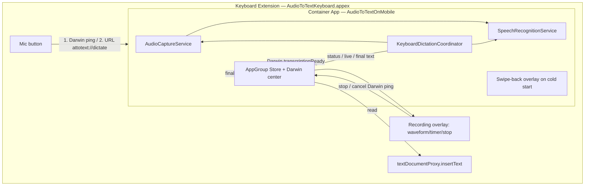

# Custom Keyboard + Voice-to-Text Integration — Research & Plan

**Project:** AudioToTextOnMobile
**Date:** 2026-08-26
**Status:** Research complete, plan ready for review

---

## 1. TL;DR

Your goal — *a custom keyboard with a voice button whose output is produced by the container app* — is
**exactly what production dictation keyboards (Wispr Flow, SuperWhisper, and the open-source
[`dictus-ios`](https://github.com/getdictus/dictus-ios)) do**. It is feasible, with one important
correction to the proposed flow:

> **The keyboard cannot reliably record microphone audio. The container app must capture the audio itself.**

The proven pattern is:

```
mic button tapped in keyboard
  → signal container app (Darwin notification, or cold-launch via URL scheme)
  → container app activates audio session, records, and transcribes (existing services!)
  → partial/final text is written to the shared App Group container
  → keyboard polls App Group / listens to Darwin notifications
  → keyboard inserts text via textDocumentProxy (the keyboard output)
```

Everything the current app already has (`AudioCaptureService`, `SpeechRecognitionService`,
on-device `SFSpeechRecognizer`) is reused as-is — the keyboard adds an IPC layer around it.

---

## 2. Research Findings (verified)

### 2.1 Keyboard extensions can't be trusted to record audio ❗

- Apple's archived App Extension guide states: *"Custom keyboards… have no access to the device
  microphone, so dictation input is not possible."* — and this restriction is **not** lifted by
  `RequestsOpenAccess = YES` (Full Access).
- Real-world experience (dictus-ios, Apple Developer Forums #742601, #821235): mic code in a
  keyboard **compiles but crashes at runtime or silently produces empty/silent audio**. dictus-ios's
  research doc explicitly lists *"Attempting Microphone Access in Keyboard Extension"* as a pitfall:
  *"Apple's sandbox blocks mic access regardless of RequestsOpenAccess."*
- Reports of it working are version-dependent and unreliable. **Conclusion: do not record in the
  keyboard. The container app owns the audio session.** This matches how Wispr Flow / SuperWhisper work.

### 2.2 The keyboard CAN open / cold-launch the container app ✅ (via SwiftUI, not UIKit)

- `UIApplication.shared.open()` — **unavailable** in extensions.
- `NSExtensionContext.open(_:)` — Apple docs: *"In iOS, the **Today and iMessage** app extension
  points support this method."* Keyboards are **not** supported (dictus confirmed `extensionContext.open`
  fails from a keyboard).
- **SwiftUI `Link(destination:)` and `@Environment(\.openURL)` DO work from keyboard extensions**
  — the system opens the URL via the responder chain. dictus-ios verified this is the only
  App-Store-safe approach. So the keyboard can open `attotext://dictate?source=keyboard` and
  **cold-launch the container app**.

### 2.3 App extensions cannot detect the host app

- `sourceApplication` (UIOpenURLContext) returns `nil` for cross-team apps since iOS 13.
- Private APIs (`_hostBundleID`, `LSApplicationWorkspace`) are removed / App Store rejection risk.
- Consequence: no auto-return to the previous app. UX fallback = iOS's natural "< Previous App"
  back chevron, or a minimal "swipe back to your keyboard" overlay in the app (dictus's
  `SwipeBackOverlayView`).

### 2.4 Inter-process communication (the supported stack)

| Channel | Use | Notes |
|---|---|---|
| **App Group** (`group.…`) shared container | All data | `UserDefaults(suiteName:)` for small state/text; file system for bulk data |
| **Darwin notifications** (`CFNotificationCenterGetDarwinNotifyCenter`) | Ping-only signaling | **No payload** — receiver reads data from App Group after each ping. Wakes a suspended app, does **not** launch a killed app. |
| **URL scheme** (`attotext://`) | Cold-launch app | Opened from keyboard via SwiftUI `Link`/`openURL`. |
| `UIBackgroundModes: audio` | App keeps recording while user is back in the keyboard | Required so the app's audio session survives the app switch. |

### 2.5 Other confirmed constraints

- **Full Access (RequestsOpenAccess) is mandatory** for: shared container with the app, and any
  network. User must enable it manually in *Settings → General → Keyboard*. App-Store-safe.
- **Keyboard extensions have a ~50 MB memory limit** — cannot run heavy on-device models
  (WhisperKit) inside the keyboard. `SFSpeechRecognizer` is light (recognition runs in a system
  daemon), but we keep it in the app anyway (2.1).
- **App Groups require a signed provisioning profile** (paid or free personal team). Keyboard
  extensions don't run in the simulator reliably; **all IPC + recording testing needs a real device**.
- Permissions are per-process/bundle: since **the app** records, only the app needs mic + speech
  permissions (already configured in `project.yml`).
- The keyboard's Info.plist is separate and needs its own `NSExtension` block
  (`com.apple.keyboard-service`) — it does **not** inherit the app's plist keys.
- `Xcode 26.6 / iOS 26.5 SDK` quirks (async authorization APIs removed, sample-rate/format
  gotchas) are already handled in the existing services — reuse them, don't rewrite.

### 2.6 Reference implementation

[`getdictus/dictus-ios`](https://github.com/getdictus/dictus-ios) — an open-source voice-dictation
keyboard built on exactly this architecture (App Group + Darwin + URL scheme, app-side WhisperKit,
keyboard-side UI + `textDocumentProxy` insertion, cold-start "swipe-back overlay"). Their
`.planning/` docs are a goldmine of lessons (watchdogs, 500 ms Darwin→URL fallback, memory limits,
review checklist). Use it as a reference; our implementation is much smaller because we already
have the transcription pipeline.

---

## 3. Target Architecture



**Data contract (App Group `UserDefaults` + Darwin notifications):**

| Shared key | Type | Writer | Reader |
|---|---|---|---|
| `dictation.status` | `idle/requested/recording/transcribing/ready/failed` | app | keyboard |
| `dictation.liveTranscript` | String | app | keyboard (optional live preview) |
| `dictation.finalText` | String + session token | app | keyboard (→ insert) |
| `dictation.requestedAt` / `stopRequested` / `cancelRequested` | Timestamp/Bool | keyboard | app |
| Darwin pings | — | both | both |

## 4. Flows

### Warm start (app already running/suspended)
1. User taps mic in keyboard.
2. Keyboard writes `status = .requested` + posts `recordingRequested` Darwin ping.
3. Suspended app is woken; `KeyboardDictationCoordinator` starts
   `AudioCaptureService` + `SpeechRecognitionService` (existing code).
4. App streams `status/.liveTranscript` back via App Group + pings. Keyboard shows recording
   overlay (waveform reads energy from App Group, ~10–20 Hz polling while active).
5. User taps **stop** → keyboard posts `stopRequested` ping → app calls
   `speechService.finishSession()`, writes `finalText`, posts `transcriptionReady`.
6. Keyboard inserts `finalText` via `textDocumentProxy.insertText(...)`.

### Cold start (app killed)
1. Keyboard posts Darwin ping, waits ~500 ms — **no response**.
2. Keyboard opens `attotext://dictate?source=keyboard` via SwiftUI `Link`/`openURL`
   (this cold-launches the app — 2.2).
3. App sees URL → activates audio session (needs `UIBackgroundModes: audio`) → starts recording +
   transcription **immediately** → shows minimal "swipe back to keyboard" overlay (or user taps
   iOS's "< Previous App" chevron).
4. User returns to keyboard → recording overlay appears (state read from App Group) → same as
   warm-start steps 4–6.

---

## 5. Implementation Plan

### Phase 0 — Prerequisites (you)
- Apple Developer team for signing (free personal team works for device install; App Groups work
  with personal team provisioning).
- A physical iPhone (keyboards + on-device speech don't work in the simulator).

### Phase 1 — Project structure (XcodeGen)
1. `project.yml`:
   - New shared source group `Shared/` compiled into **both** targets (or a small
     `AudioToTextShared` framework target; plain shared folder is simplest with XcodeGen).
   - New target `AudioToTextKeyboard` (`type: app-extension`, `platform: iOS`):
     - `PRODUCT_BUNDLE_IDENTIFIER: com.example.AudioToTextOnMobile.Keyboard`
     - `APPLICATION_EXTENSION_API_ONLY: YES`
     - `INFOPLIST_KEY_NSExtension…` block: `NSExtensionPointIdentifier = com.apple.keyboard-service`,
       `NSExtensionPrincipalClass = KeyboardViewController`,
       `NSExtensionAttributes: { RequestsOpenAccess: YES, IsASCIICapable: NO,
       PrefersRightToLeft: NO, PrimaryLanguage: en-US }`
     - Info.plist additions: `NSMicrophoneUsageDescription` (defensive), `LSApplicationQueriesSchemes`
       (for future `canOpenURL` checks).
   - App target additions:
     - `INFOPLIST_KEY_CFBundleURLTypes` → scheme `attotext`
     - `UIBackgroundModes: [audio]`
   - **App Group entitlement `group.com.example.AudioToTextOnMobile`** on both targets (entitlements
     files; `com.apple.security.application-groups`).
2. `xcodegen generate`, build for device.

### Phase 2 — Shared IPC layer (`Shared/`)
- `AppGroup.swift` — group ID constant, `UserDefaults(suiteName:)` singleton, shared container URL.
- `DarwinNotifications.swift` — typed `post(name:)` / `observe(name:handler:)` wrappers around
  `CFNotificationCenterGetDarwinNotifyCenter`; names: `recordingRequested`, `stopRequested`,
  `cancelRequested`, `statusChanged`, `transcriptionReady`.
- `DictationSharedState.swift` — key constants + Codable status enum + typed get/set helpers
  (session token guards against stale reads).

### Phase 3 — App side
- `Services/KeyboardDictationCoordinator.swift` — new, `@MainActor @Observable`:
  - Listens for Darwin pings; on `recordingRequested` runs the same
    `beginRecording()` logic as `TranscriptionViewModel` (extract that logic into a shared
    `TranscriptionSession` driver used by both the in-app VM and the coordinator).
  - Writes status/live/final text to App Group; posts `statusChanged`/`transcriptionReady`.
  - Handles `attotext://dictate?source=keyboard` (`onOpenURL` in
    `AudioToTextOnMobileApp.swift`) → start session + set "keyboard cold-start" flag.
- `Views/KeyboardReturnOverlayView.swift` — minimal full-screen "swipe back to your keyboard"
  screen shown when launched via keyboard URL (cleared on `.background`).
- Keep `TranscriptionViewModel` + existing UI untouched (regression-free).

### Phase 4 — Keyboard extension (`AudioToTextKeyboard/`)
- `KeyboardViewController.swift` — `UIInputViewController`, hosts a SwiftUI root via
  `UIHostingController`; exposes `hasFullAccess` (`requestOpenAccess()` result), `textDocumentProxy`
  to the root.
- `KeyboardRootView.swift` + `KeyboardView.swift` — QWERTY keys (basic typing) + globe key
  (`advanceToNextInputMode`) + **mic button**.
- `KeyboardState.swift` — `ObservableObject` mirroring `DictationSharedState`:
  - `startRecording()`: write `.requested` → post Darwin ping → 500 ms watchdog → fallback
    `openURL(attotext://dictate?source=keyboard)` via injected `@Environment(\.openURL)`.
  - Poll App Group ~10–20 Hz while `recording/transcribing` for waveform/status; on
    `transcriptionReady` → `controller.textDocumentProxy.insertText(finalText)`.
  - `stopRecording()`/`cancelRecording()` post pings.
- `RecordingOverlayView.swift` — waveform (reuse `WaveformView` styling), timer, stop/cancel.
- `FullAccessBanner.swift` — if `hasFullAccess == false`, show a banner; tapping it opens
  `attotext://settings` via `Link` to guide the user in the app.

### Phase 5 — App onboarding polish (small)
- Detect keyboard install state via `UITextInputMode.activeInputModes` (contains the keyboard
  bundle ID) → "Enable Full Access" instructions screen in the app.
- Settings screen: language picker (already a roadmap item) writing locale to App Group so both
  processes agree.

### Phase 6 — Device verification
1. Enable keyboard: *Settings → General → Keyboard → Add New Keyboard → AudioToText* → toggle
   **Full Access**.
2. Warm start: launch app, switch to another app, open keyboard, tap mic → speak → stop → text
   inserted. Live waveform animates in the keyboard while the app is backgrounded.
3. Cold start: force-quit the app → tap mic in keyboard → app opens with swipe-back overlay →
   return to keyboard → record → stop → text inserted.
4. Permission prompts: mic + speech appear **in the app** (first cold start).
5. Interruptions (incoming call), app relaunch mid-session, Full Access disabled — all must
   degrade gracefully (watchdogs clear stale states).

---

## 6. Risks & Mitigations

| Risk | Mitigation |
|---|---|
| Keyboard mic unreliable → **cannot** stream voice *from* the keyboard | Corrected architecture: the app captures audio itself (proven by dictus/Wispr Flow). The keyboard "streams" control signals, not audio. |
| Cold-start URL can't auto-return to host app | Minimal swipe-back overlay + iOS "< Previous App" chevron; no private APIs. |
| Darwin ping lost / app crashed mid-session | Watchdogs (keyboard: ~5 s stale-waveform watchdog; app: transcription timeout) + 500 ms ping→URL fallback. |
| App suspended while recording (background audio) | `UIBackgroundModes: audio`; activate audio session before any app switch (dictus lesson). |
| 50 MB keyboard memory limit | Keyboard holds no ML models — only UI + IPC. |
| App Group not available on simulator | Signing + real device for end-to-end; unit-test `DictationSharedState` encoding in CI/simulator. |
| App Store review (Full Access + URL schemes) | Follow dictus review checklist: justify Full Access solely for shared container, no network in keyboard, privacy policy. |

## 7. Open Questions (for you)

1. **App Group ID**: `group.com.example.AudioToTextOnMobile` OK, or do you have a preferred
   bundle prefix / team?
2. **Keyboard scope**: full QWERTY keyboard (replaces system keyboard) or a minimal keyboard whose
   main job is dictation + basic typing? (Full keyboard = more work; minimal = fastest to value.)
3. **Live partial text**: show partial results inside the keyboard overlay while speaking
   (nicer, slightly more IPC traffic), or only insert on stop?
4. Are you OK with the **corrected audio flow** (app captures, keyboard signals) as the
   implementation target?

## 8. References

- Apple — [Custom Keyboard (App Extension Programming Guide, archive)](https://developer.apple.com/library/archive/documentation/General/Conceptual/ExtensibilityPG/CustomKeyboard.html)
- Apple — [App Extensions (documentation)](https://developer.apple.com/documentation/uikit/app-extensions)
- Apple — [NSExtensionContext.open(_:completionHandler:)](https://developer.apple.com/documentation/foundation/nsextensioncontext/open(_:completionhandler:))
- Apple — [Sharing Data with Your Containing App (archive)](https://developer.apple.com/library/archive/documentation/General/Conceptual/ExtensibilityPG/ExtensionScenarios.html)
- [`getdictus/dictus-ios`](https://github.com/getdictus/dictus-ios) — reference implementation +
  `13-cold-start-audio-bridge` research/verification docs
- Apple Developer Forums #742601 (mic in keyboard), #821235 (dictation gap)
